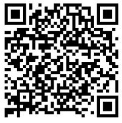

# SSD_detect_tensorflow
How to detect objects by using SSD models in tensorflow.

## Introduction
* Help to detect objects by using trained SSD models and detect script.
* I downloaded and changed PASCAL-VOC2007/VOC2012 data into tfrecord, and trained and tested SSD models in [SSD Tensorflow](https://github.com/balancap/SSD-Tensorflow).
* It can detect 20 classes objects included animal/traffic/house/people etc.

## Requirements
* Python
* NumPy
* [Tensorflow](https://github.com/tensorflow/tensorflow)

## Usage
* Get code
```shell
git clone --recursive https://github.com/avBuffer/SSD_detect_tensorflow.git
cd SSD_detect_tensorflow
```
* Get SSD models
  * Step1: Please download from Baidu Pan:
	  * Website: https://pan.baidu.com/s/1o8xaywy 
	  * Password: nv9k

  * Step2: Please unzip checkpoints.zip, and move these models (included VGG_VOC0712_SSD_300x300_iter_120000.ckpt.data-00000-of-00001 and VGG_VOC0712_SSD_300x300_iter_120000.ckpt.index) into folder of SSD_detect_tensorflow/checkpoints.

* Scripts
```shell
cd SSD_detect_tensorflow/src
python ssd_detect.py
```
* Also import the project into Eclipse, such as "File->Import->General/Existing Projects into Workspace". But you should install PyDev in Eclipse.

## Issues
* If you have any idea or issues, please keep me informed.
* My Email: jalymo at 126.com, and my QQ/Wechat: 345238818

## Wechat&QQ group 
* I setup VoAI Wechat group, which discusses AI/DL/ML/NLP.
* VoAI means Voice of AI, Vision of AI, Visualization of AI etc.
* You can joint VoAI Wechat group by scanning QR-code in path ./imgs/VoAI.jpg.
* 

* Also you can joint QQ group ID: 183669028

Any comments or issues are also welcomed.Thanks!
